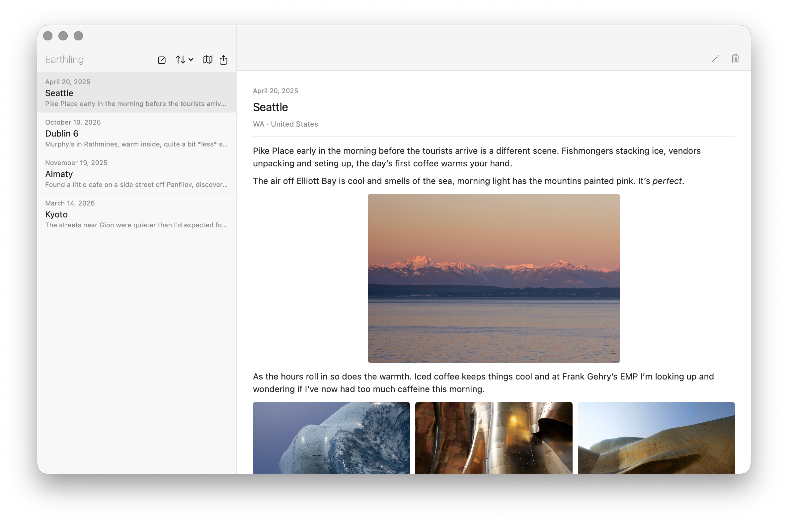

# Earthling

A private, minimal travel journal for macOS. No accounts, no subscriptions, no ads, no telemetry or cloud services you don't control. Just you and your journal, around the world.

---

## Features

- Write journal entries with date, location, and freeform text
- Location autocomplete via Apple MapKit — no third-party API required
- Entries stored as human-readable Markdown files with YAML frontmatter
- Geographic folder hierarchy: Continent / Country / City / Sublocation
- 10 visual themes
- Photo support — inline and gallery
- World map view
- Export to PDF, JSON, and CSV

## Requirements

- macOS 26 (Tahoe) or later
- Xcode 16 or later
- A free Apple ID (no paid developer account required)

## Installation

Earthling is distributed as source code only. You build and run it yourself using Xcode — no paid Apple Developer account required.

See [docs/user-guide.md](docs/user-guide.md) for full build instructions.

## Data & Privacy

All entries are stored in the app's private sandbox container on your Mac. No entry or photo is transmitted to any server — not to Internet Elephant, not to any third party. No accounts are required. Your files remain readable plain text with or without the app.

Note: Location autocomplete uses Apple MapKit. Search queries are sent to Apple's servers associated with a rotating anonymous identifier, not your Apple ID or any account information. No location data is transmitted to or stored by Internet Elephant.

## Trademark

Earthling is a trademark of Internet Elephant. Forks must be released under a different name.

## License

MIT License — see [LICENSE](LICENSE) for full text.

Copyright (c) 2026 Internet Elephant
